## 使用方法

列车信息按以下顺序显示：

1. 列车种别（即 MTR 中的线路编号）
2. 时间
3. 目的地
4. 到发站台

站台用显示屏最多显示2班列车，站厅用显示屏最多显示3班列车。

### 通用操作
以下操作可用于这两种预设。

**更改信息标题**

在 PIDS 的第1行消息输入框中输入文字，即可更改信息标题。

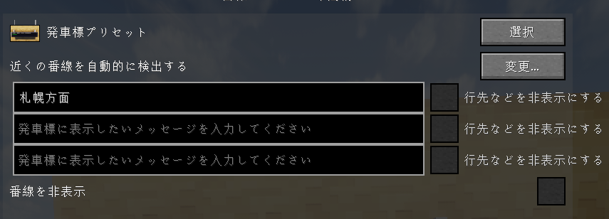

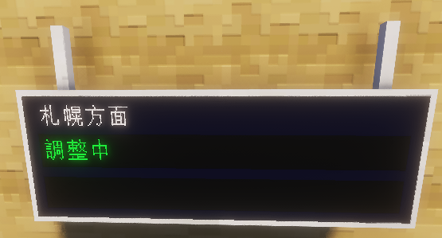

截图中的“札幌方面”即为信息标题。

如果没有输入文字，则显示“発車ご案内 Train Infomation”。

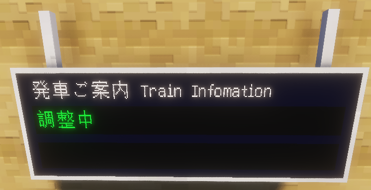

**站台显示**

默认显示列车的到发站台。如需隐藏，请勾选“隐藏站台”。

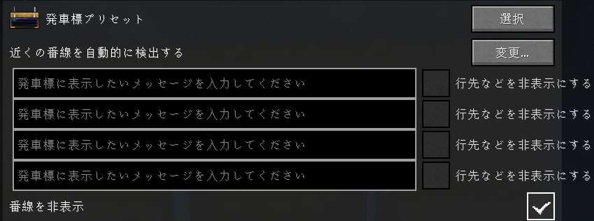

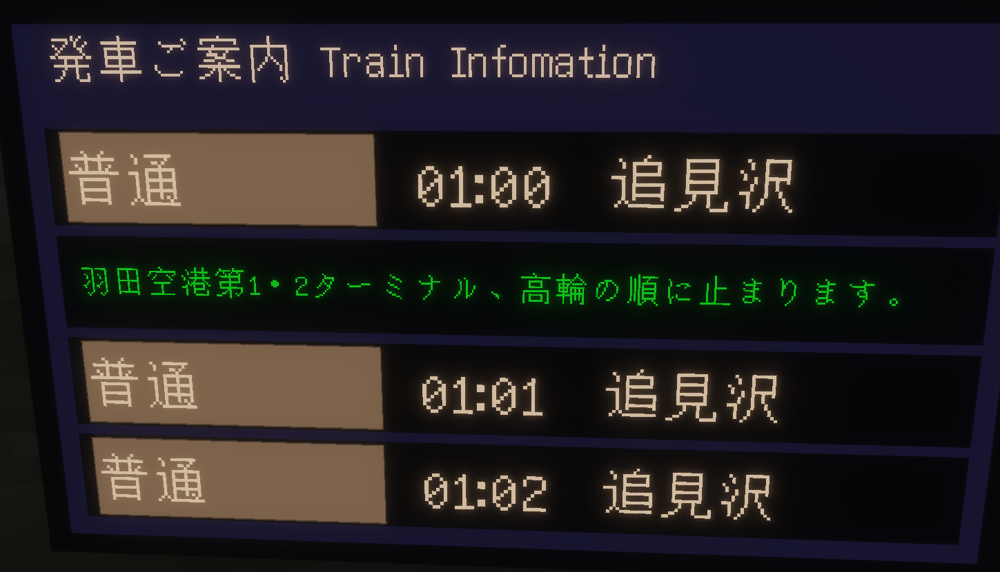

**消息文字显示**

在 PIDS 的第2行消息输入框中输入文字，即可将其显示在最后一行列车信息中。

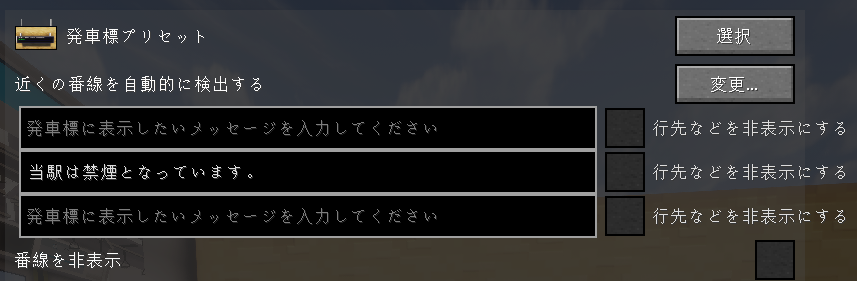

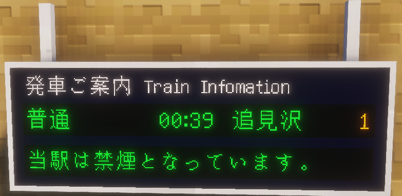

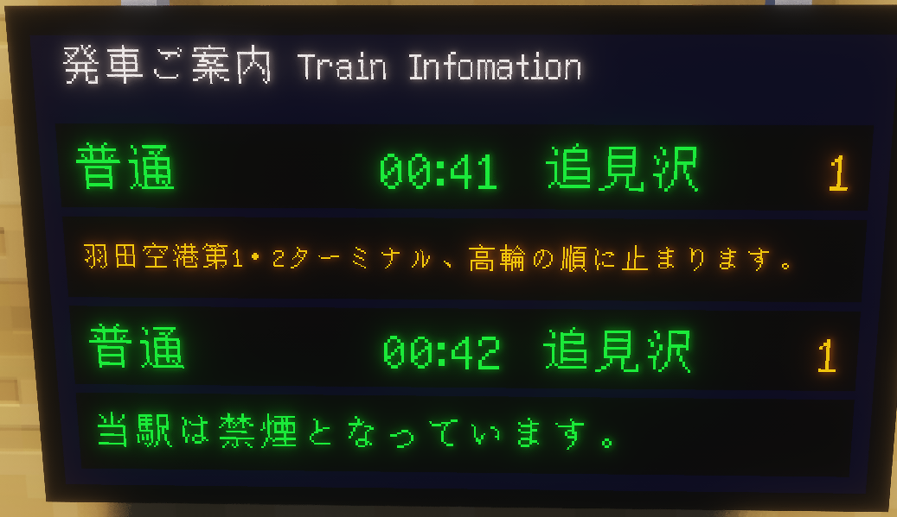

输入28个或更多字符时，文字将滚动显示。

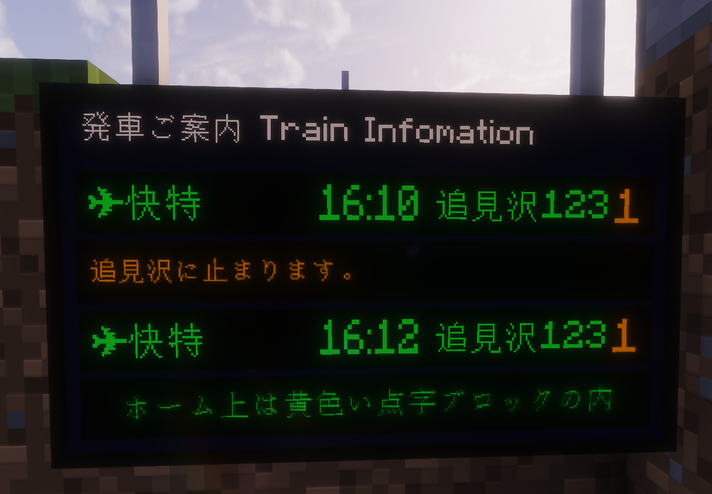

默认情况下，普通列车信息与消息每15秒切换一次。输入28个或更多字符时，会在滚动结束后切换。如需只显示消息，请勾选 PIDS 第2行消息输入项的“隐藏目的地等信息”。

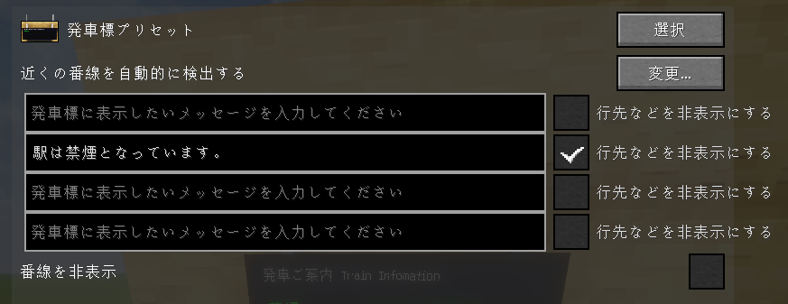

无论使用哪种方块，这两种预设都会分别显示在选择界面中，并根据所选预设切换布局。

**多语言显示**

如果在 MTR 中使用`|`分隔并输入多语言站名或线路名称，本预设会解析这些内容，并每5秒切换一次显示语言。

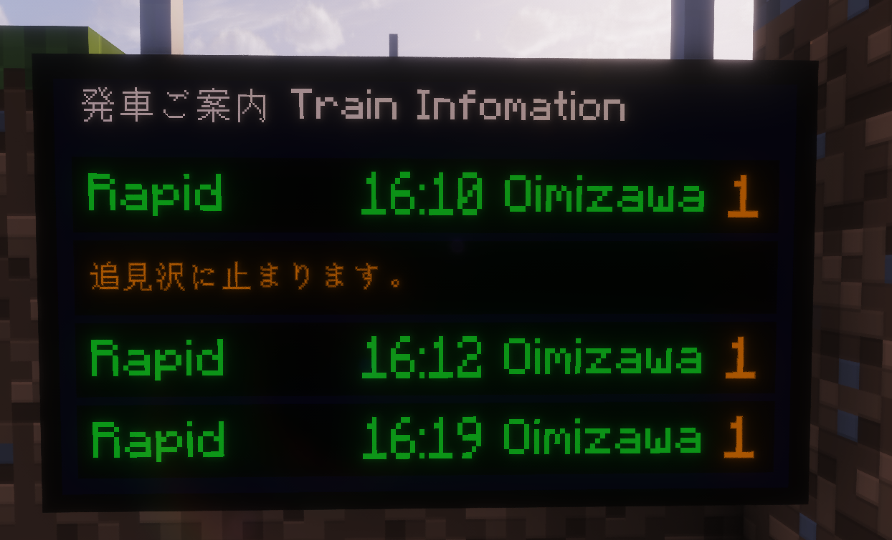

如需关闭此功能并只显示第一种语言，请勾选 PIDS 第3行消息输入项的“隐藏目的地等信息”。

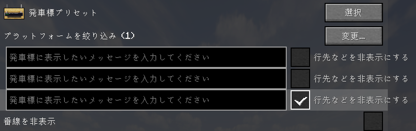

如果站名或线路名称没有输入多语言内容，则会原样显示。仅在需要主动关闭多语言切换时勾选此选项。

## 仅站台用显示屏的行为与操作
站台用显示屏会从列车到达前25秒开始闪烁显示“列車がまいります。”，并在列车到达后自动消失。此提示的优先级高于列车信息和消息显示。

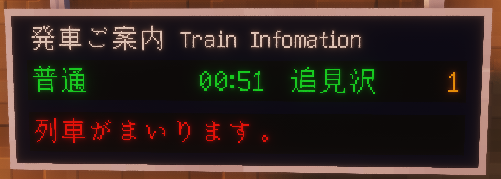

如需关闭列车接近提示，请勾选第1行消息输入项的“隐藏目的地等信息”。

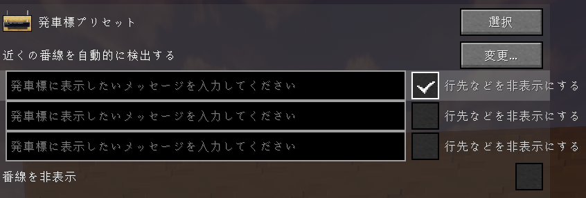

如果首班列车的停靠站信息过长，字号会自动缩小以适应显示区域。

在 LCD 版本中，如果勾选第2行消息输入项的“隐藏目的地等信息”，第4行会固定显示该消息；如果未勾选，则每15秒在第3班列车与消息之间切换。

## 仅站厅用显示屏的行为
站厅用显示屏的第2行会显示首班列车接下来的最多两个停靠站。

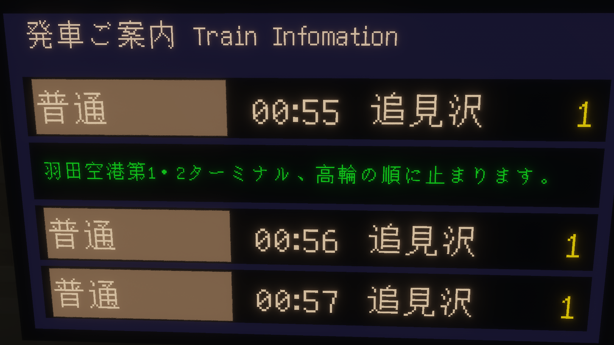
