## 使い方

列車の表示については、次の順番で表示されます。

1. 種別(MTR内でいう系統番号)
2. 時刻
3. 行き先
4. 発着番線

ホーム用では2本、コンコース用では3本まで列車を表示します。

### 共通操作
以下は、本プリセットで行える共通の操作です。

**案内ヘッダ変更**

発車標のメッセージ入力1段目にテキスト入力すると、案内ヘッダを変更することができます。

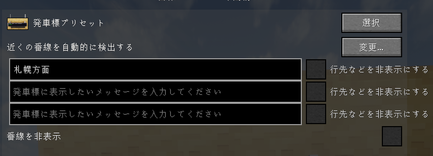

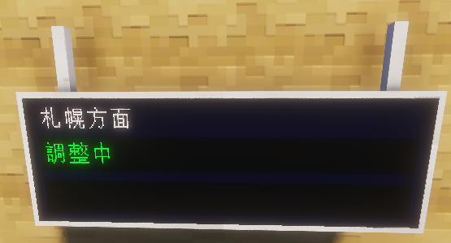

「札幌方面」と書かれているのが案内ヘッダです。

なお、テキストを入力していない場合は、「発車ご案内 Train Infomation」と表示されます。

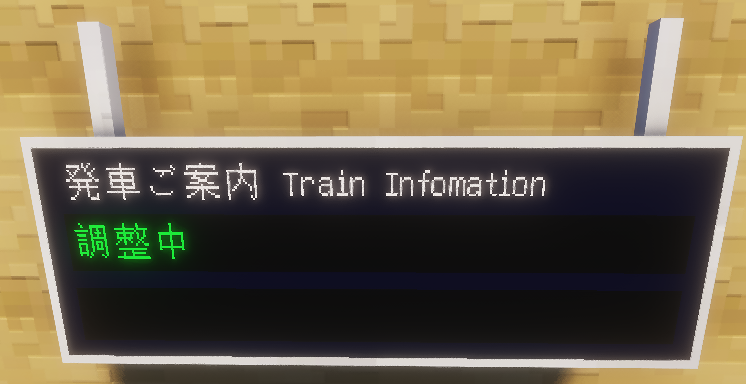

**番線表示**

デフォルトでは列車の発着番線が表示されます。表示を無効化したい場合は、「番線を非表示」にチェックを入れてください。

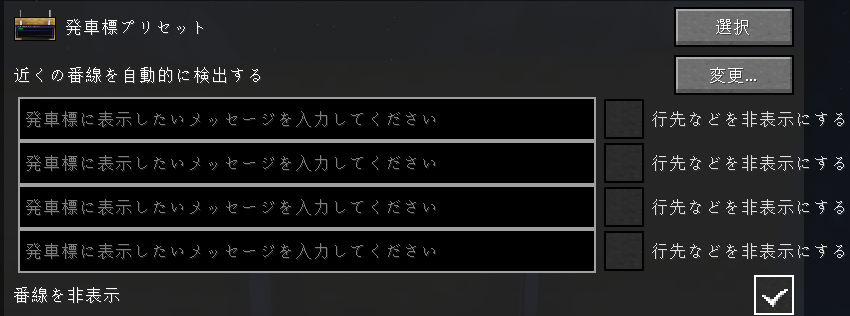

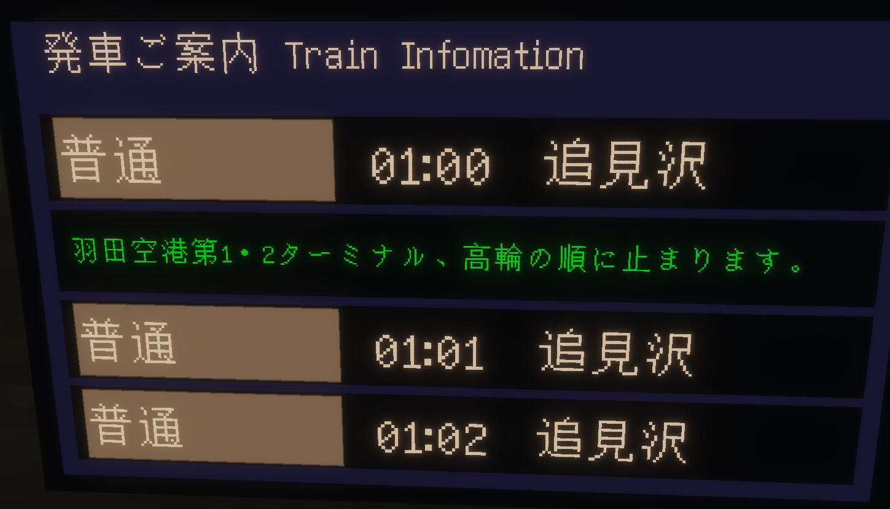

**メッセージテキスト表示**

発車標のメッセージ入力2段目にテキスト入力すると、最後尾の列車表示列にて表示することができます。

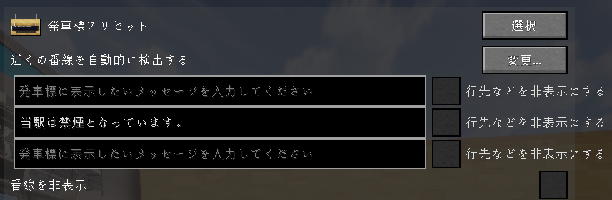

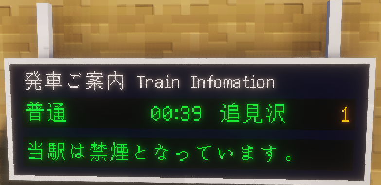

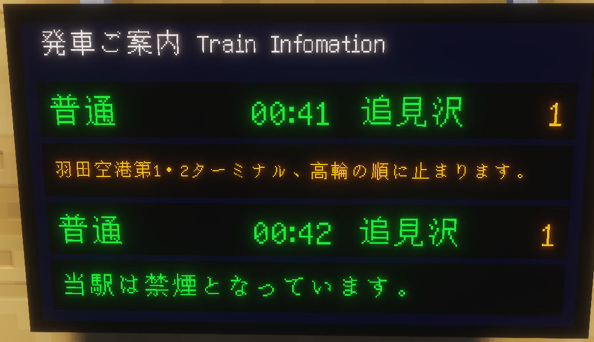

なお、デフォルトでは通常の列車表示と6秒おきに切り替わります。メッセージのみを表示したい場合は、発車標のメッセージ入力2段目の「行先などを非表示にする」にチェックを入れてください。

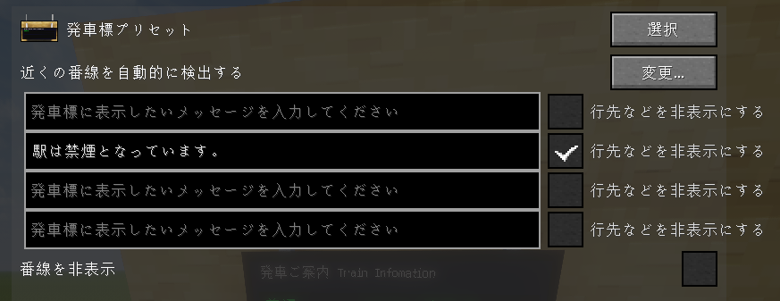

2つのプリセットはブロック種類に関係なく選択画面へ個別に表示され、選択したプリセットによってレイアウトが切り替わります。

## ホーム用のみの動作・操作
ホーム用では、列車到着の25秒前から「列車がまいります。」を点滅表示します。これは、列車が到着すると自動で消えます。この動作は、列車表示、メッセージ表示よりも優先されます。

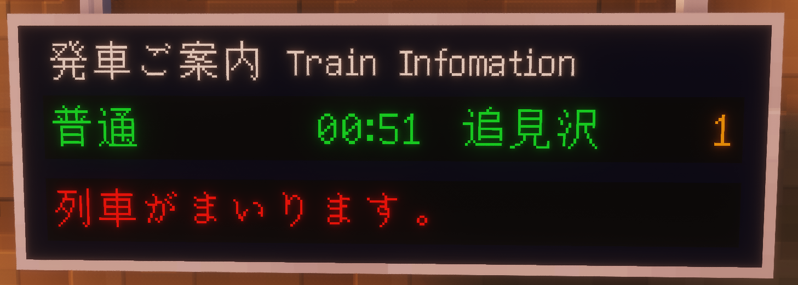

列車接近動作を無効化したい場合は、メッセージ入力1段目の「行先などを非表示にする」にチェックを入れてください。

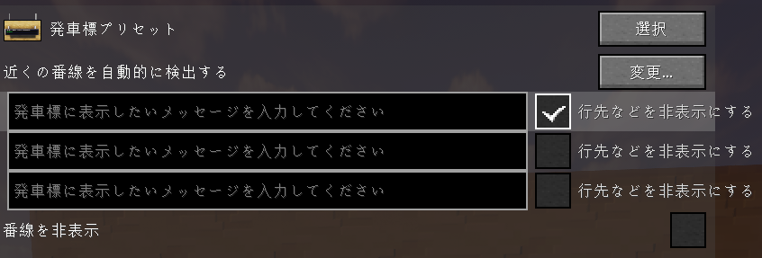

先発列車の停車駅が長い場合は、表示枠に収まるよう文字サイズを縮小します。

LCD版の4段目は、メッセージ入力2段目の「行き先などを非表示」が有効ならメッセージを固定表示し、無効なら次々発列車と6秒ごとに交互表示します。

## コンコース用のみの動作
コンコース用の2段目では先発列車の停車駅が、次々駅まで表示されます。

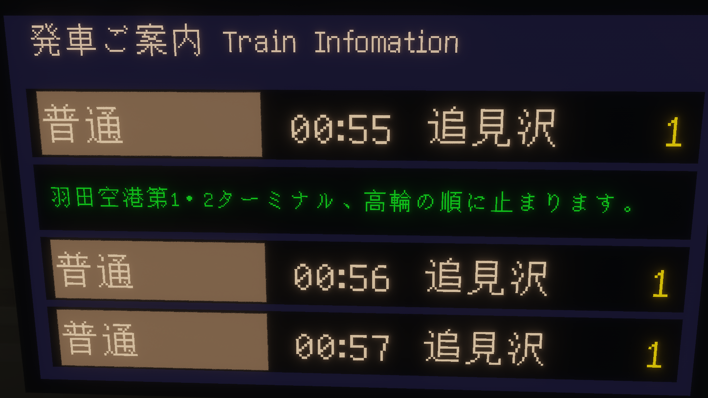